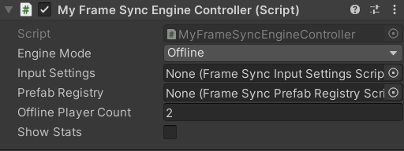
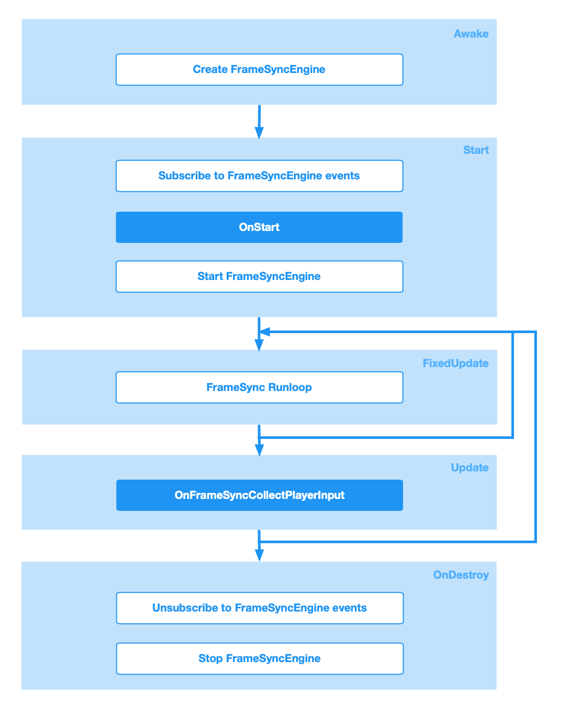

# **FrameSyncEngineController**
Your code interacts with the `FrameSyncEngine` by implementing a class derives from the built-in class `FrameSyncEngineController`.

{: width=512 }

## **Properties**

| **Name**       | **Function**                          |
| ----------- | ------------------------------------ |
| Engine Mode     |  FrameSyncEngine mode, the options are: `Offline`, `Online`, and `OnlineRollback`.  |
| Input Settings       | The [input settings][16] ScriptableObject.|
| Prefab Registry      | The [Prefab Registry][17] ScriptableObject. |
| Offline Player Count   | The number of players in offline mode. |
| Show Stats      | If enabled, `FrameDelay`, `InputDelay` and `Frame Buffered` will be displayed at the top left corner.  |

## **Interaction with Unity**
The base `FrameSyncEngineController` is a subclass of `MonoBehaviour` and implements the `Awake()`, `Start()`, `FixedUpdate()`, `Update()`, `OnDestroy()`, and `OnGUI()` methods. Please see the chart below.

{: width=1080 }

???+ info

    Different FrameSyncEngine modes have different FrameSync runloop execution order.
    
    Please check [Offline Mode][15], [Online Mode][19], [Prediction/Rollback Mode][20] for details.

## **Events**
The `FrameSyncEngineController` provides a collection of useful events which allow you to customize the behaviour of the FrameSyncEngine for your game.

| **Input Sample Events**       |                       |
| ----------- | ------------------------------------ |
| [OnFrameSyncCollectPlayerInput][1]       |  Called when the FrameSyncEngine samples the inputs of the local player.  |

| **Player Status Change Events**       |                     |
| ----------- | ------------------------------------ |
| [OnFrameSyncNewPlayerConnected][2]       |  Called when a player connects to the room.  |
| [OnFrameSyncPlayerReconnected][3]       |  Called when a player reconnects to the room.  |
| [OnFrameSyncPlayerDisconnected][4]       |  Called when a player disconnects.  |

| **Desync Detection Events**       |                     |
| ----------- | ------------------------------------ |
| [OnFrameSyncDesyncDetected][5]       |  Called when a simulation desync is detected. By default, the method returns false.  |

| **Simulation Events**       |                     |
| ----------- | ------------------------------------ |
| [OnFrameSyncFinishedSimulationForCurrentFrame][6]       | Called after the StaticFrameSyncBehaviours and the DynamicFrameSyncBehaviours finished simulation for the current FrameSync step. |
| [OnFrameSyncWillFinishCurrentFrame][7]       |  Called before the current Frame finishes. |

| **Custom Restorable Events**       |                     |
| ----------- | ------------------------------------ |
| [OnFrameSyncCreateCustomRestorable][8]       |  Called after the FrameSyncEngine exported the data from the StaticFrameSyncBehaviours and the DynamicFrameSyncBehaviours. |
| [OnFrameSyncWillUseCustomRestorable][9]       |  Called before the FrameSyncEngine uses a custom IFrameSyncSnapshot object for restoration.  |
| [OnFrameSyncImportCustomRestorable][10]       |  Called when importing game states data from server. |

| **Custom Hashcode Events**       |                     |
| ----------- | ------------------------------------ |
| [OnFrameSyncGetCustomHashCode][11]       | Called when calculating a hash for the current simulation step. |

| **Game State Restoration Events**       |                     |
| ----------- | ------------------------------------ |
| [OnFrameSyncWillRestoreGameStates][18]       |  Called when the client connects to a game and needs to restore the game states  |
| [OnFrameSyncDidCreateGameObjectForRestoration][12]       |  Called after the FrameSyncEngine creates a GameObject for restoration.  |
| [OnFrameSyncWillDestroyGameObjectForRestoration][13]       |  Called before the FrameSyncEngine destroys a GameObject for restoration.  |

| **FrameSyncGame Events**       |                     |
| ----------- | ------------------------------------ |
| [OnFrameSyncGameStateChanged][14]       |  Called when the FrameSyncGame state changes.  |
| [OnFrameSyncGameInitialize][21]       |  Called before the FrameSyncGame starts.  |

[1]: events/OnFrameSyncCollectPlayerInput.md
[2]: events/OnFrameSyncNewPlayerConnected.md
[3]: events/OnFrameSyncPlayerReconnected.md
[4]: events/OnFrameSyncPlayerDisconnected.md
[5]: events/OnFrameSyncDesyncDetected.md
[6]: events/OnFrameSyncFinishedSimulationForCurrentFrame.md
[7]: events/OnFrameSyncWillFinishCurrentFrame.md
[8]: events/OnFrameSyncCreateCustomRestorable.md
[9]: events/OnFrameSyncWillUseCustomRestorable.md
[10]: events/OnFrameSyncImportCustomRestorable.md
[11]: events/OnFrameSyncGetCustomHashCode.md
[12]: events/OnFrameSyncDidCreateGameObjectForRestoration.md
[13]: events/OnFrameSyncWillDestroyGameObjectForRestoration.md
[14]: events/OnFrameSyncGameStateChanged.md
[18]: events/OnFrameSyncWillRestoreGameStates.md
[21]: events/OnFrameSyncGameInitialize.md

[15]: offline.md
[19]: online.md
[20]: rollback.md

[16]: ../InputSettings.md
[17]: ../PrefabRegistry.md
