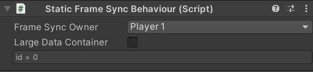

# **StaticFrameSyncBehaviour**
The `StaticFrameSyncBehaviour` is a subclass of `MonoBehaviour`. It acts as the unique identifier of a GameObject. It is designed for GameObjects that are not dynamically instantiated or destroyed. If a GameObject is instantiated or destroyed at runtime, `DynamicFrameSyncBehaviour` should be used.

{: width=512 }
