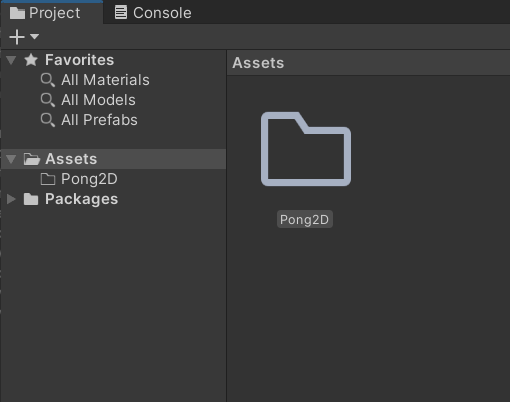
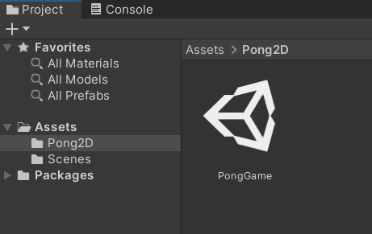
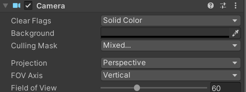
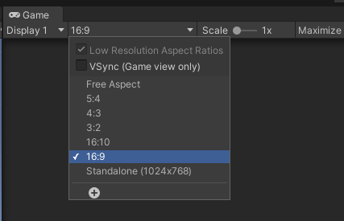

# **Get Started**

To get started, in the **Project** window, create a new folder under the `Assets` folder and name it `Pong2D`. All the assets used in this game will be created inside of this folder to make them easy to find.

{: width=512 }

After that, create a new scene in the `Pong2D` folder and name it `PongGame`.
{: width=512 }

Open the `PongGame` scene, select the `Main Camera` in the **Hierarchy**.

- Set `Clear Flags` to `Solid Color`
- Set `Background` to a color you like.

{: width=512 }

- Set `Aspect ratio` of the `Game` window to `16:9`.
{: width=720 }