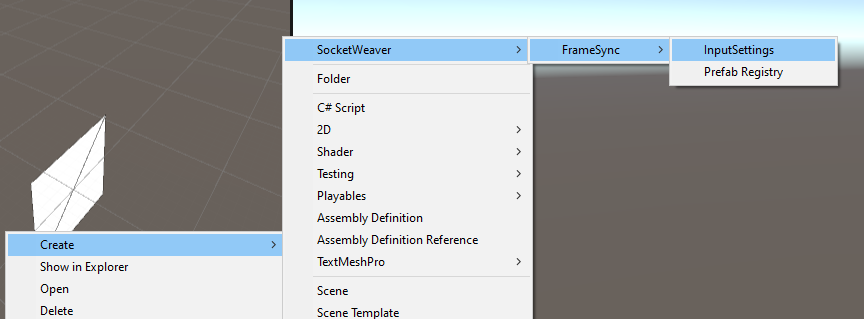
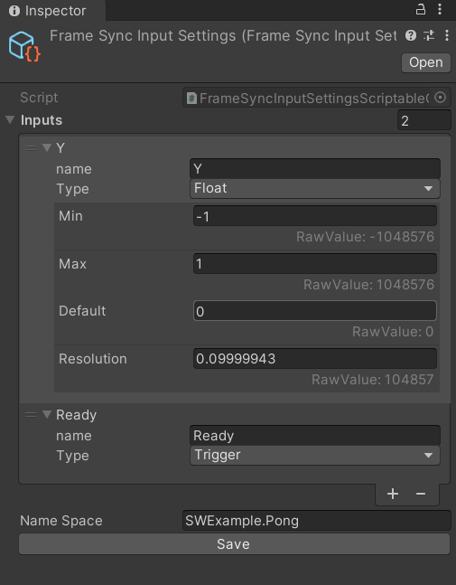

# **Declare Inputs for Your Game**

The FrameSync library exchanges and manages player inputs. You will create an InputSettings scriptableObject to declare the inputs that your game uses.

## **Creating an InputSettings ScriptableObject**

- Right click in the project browser, and select `Create->SocketWeaver->FrameSync->InputSettings`. 
- Name the new asset `FrameSyncInputSettings`.

{: width=1080 }

## **Adding Inputs**

In this game, the player uses the **Vertical Axis** to move the paddle vertically and uses the **G** key to tell the game that they are ready to play.

- Select the `FrameSyncInputSettings` and configure it as shown below.
{: width=512 }
- Make sure that `Name Space` is set to `SWExample.Pong` which is the c# namespace of this game.
- Click the `Save` button.

???+ info

    Extension methods will be generated under the provided namespace to help you get and set the inputs.
    You can see the generated code at `Assets->SocketWeaver->framesync_generated_input->{Your namespace}`
