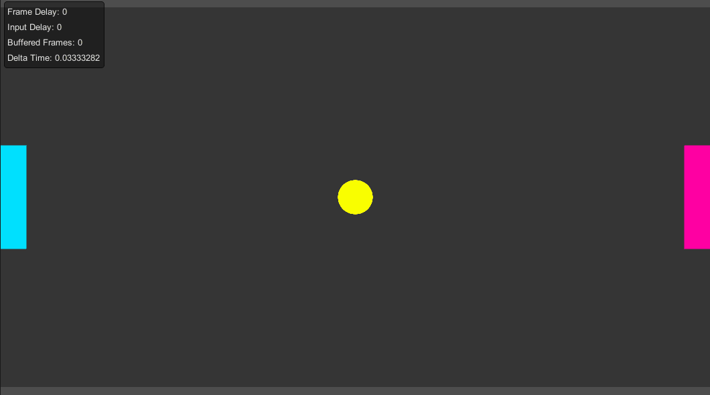

# **Overview**

Pong 2D is a fully functional multiplayer game made with Unity. It is deisgned to help you get started with the SocketWeaver FrameSync library.

!!! note ""

    The tutorials should take less than **30** mintues to complete.

{: width=1080 }

In these step-by-step tutorials, you will:

- Learn how to use the FPhysics2D engine
- Learn to create a InputSettings scriptableObject for your game
- Learn how the FrameSyncEngine samples local players inputs and how to read networked inputs
- Learn to use the FrameSyncRandom API to generate deterministic pseudo random numbers

By following these simple tutorials, you will learn the basics of the FrameSync library and will be ready to explore more advanced features that the library provides.