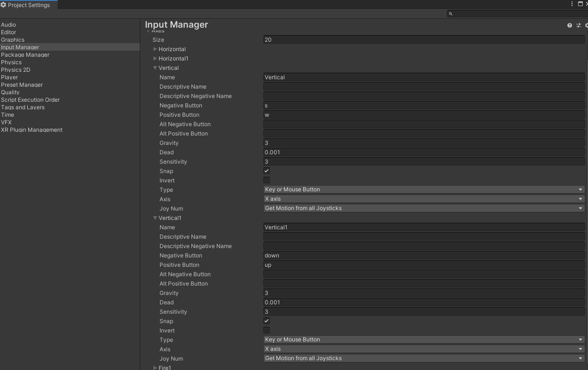
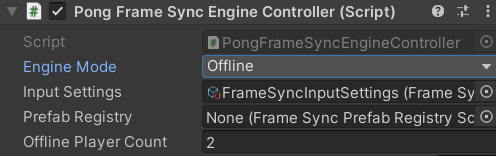

# **Playing Offline**

In this section, you will add support for playing the game offline. 

- Go to `Edit->ProjectSettings->Input manager`. 
- Right-Click the input `Vertical` and `Duplicate Array Element`. 
- Name the new input `Vertica1`.
- Remove the `Alt Negative Button` and `Alt Positive Button` of the the old `Vertical` input.
- Remove the `Alt Negative Button` and `Alt Positive Button` of the the new `Vertical1` input.
- Set `Negative Button` to `s` and `Positive Button` to `w` for the old `Vertical` input.
- Set `Negative Button` to `down` and `Positive Button` to `up` for the new `Vertical1` input.

{: width=1080 }

Next, select the `PongFrameSyncEngineController` component, set `Engine Mode` to Offline and `Offline Player Count` to 2.

{: width=512 }

Update the `OnFrameSyncCollectPlayerInput` method of `PongFrameSyncEngineController`.

=== "C#"
    ``` c#
    protected override void OnFrameSyncCollectPlayerInput(FrameSyncEngine frameSyncEngine, FrameSyncGame game)
    {
        if (engineMode == EngineMode.Offline)
        {
            //player1 and player2 are created because we set Offline Player Count to 2.
            FrameSyncPlayer player1 = game.GetPlayer(1);
            FrameSyncPlayer player2 = game.GetPlayer(2);

            //player1 uses w and s to move and uses g to trigger the ready event.
            player1.SetInputY((FFloat)Input.GetAxis("Vertical"));
            player1.SetInputReady(Input.GetKeyUp(KeyCode.G));

            //player2 uses up arrow and down arrow to move and uses h to trigger the ready event.
            player2.SetInputY((FFloat)Input.GetAxis("Vertical1"));
            player2.SetInputReady(Input.GetKeyUp(KeyCode.H));
        }
        else
        {
            game.localPlayer.SetInputY((FFloat)Input.GetAxis("Vertical"));
            game.localPlayer.SetInputReady(Input.GetKeyUp(KeyCode.G));
        }
    }

    ```

Now, you are ready to play the game in the offline mode. Just hit play. You should be able to move the paddles with the `w`, `s` keys or with the arrow keys.

To start the match, you can press `g` to make player1 ready, and press `h` to make player2 ready.

{: width=1080 }