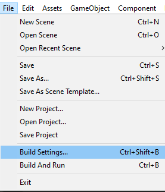
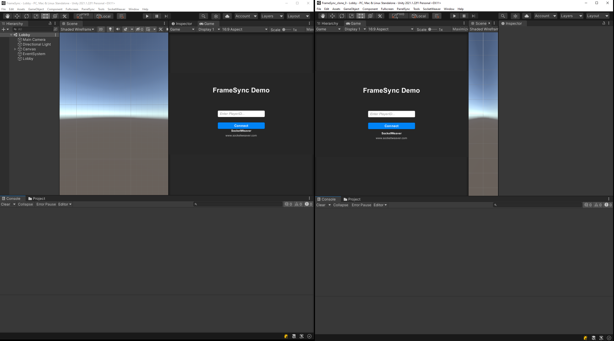
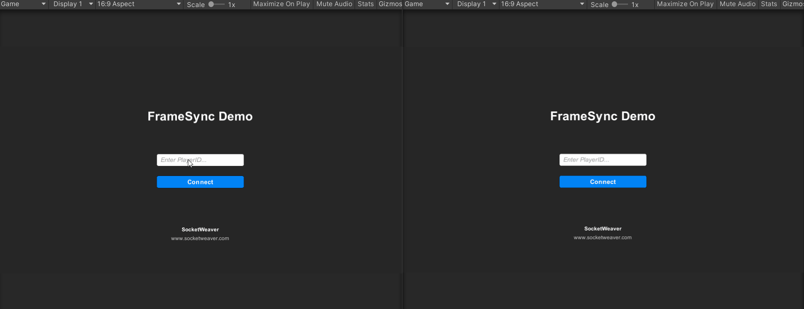

# **Playing Online**

In this section, you will connect to the **SocketWeaver** cloud service to play online.

## **Installing ParrelSync**

To make developing multiplayer games easy with Unit, install the ParrelSync unitypackage from https://github.com/VeriorPies/ParrelSync. It will save you a lot of time. We highly recommend it!

## **Launch Another Instance of The Unity Editor**

Once you installed ParrelSync, Select `ParrelSync->Clones Manager->Add new clone`, and select `Open in New Editor` after the clone is created.

## **FrameSync Demo Lobby Scene**

You will use the demo lobby scene that comes with the library to handle the matchmaking of the game.

- Open the Lobby scene.
- Select the Lobby GameObject and set `Scene Name` to `PongGame`.

By setting `Scene Name` to `PongGame`, The demo lobby scene will navigate to the `PongGame` scene after when the connection to the cloud service is ready.

???+ info

    Make sure to add the `PongGame` scene to the build settings.

    {: width=512 }

???+ info

    Make sure to change the `Engine Mode` of the `PongFrameSyncEngineController` to `Online`. 

Move the Unity Editors side by side. Now, you can play the game online. Hit play!

{: width=1080 }

Enter `1` as the playerID for player1 and enter `2` as the playerID for player2.

{: width=1080 }
