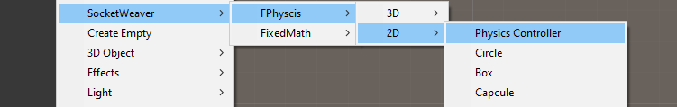
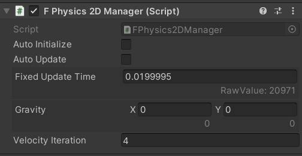
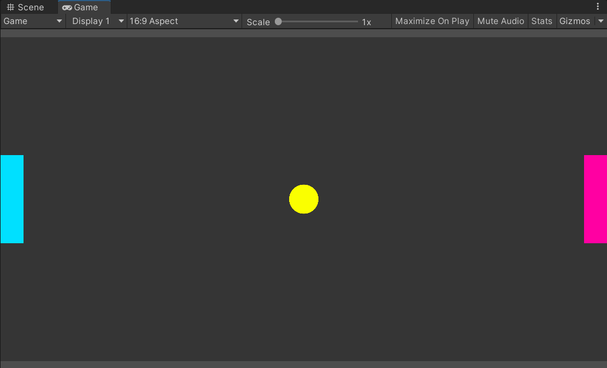

# **Set Up The Scene**

Download the assets from our github repository.

Drag the Playground to the `SoccarGame` scene.
Import the Samples of the FPhysics3D

## **FPhysics3DManager**
For your first step, you will create a `FPhysics3DManager`. Right-Click in the `Hierarchy` window and select `SocketWeaver->FPhysics->3D->Physics Controller`.

{: width=768 }

The `FPhysics3DManager` controls the FPhysics engine and manages rigidbodies in the scene. 
Disable `Auto Initialize` and `Auto Update` because you will manually initialize the FPhysics engine and manually update it.

{: width=768 }

## **Rigidbodies**

Next, you will create the following Rigidbodies.

Name    | Body Type | Description
--------| --------- | ----------------
Ball    | Dynamic   | Controlled by physics
Paddles | Kinematic | Controlled by players
Walls   | Staic     | Do not move

## **Ball**

- Select `SocketWeaver->FPhysics->2D->Circle`. A circle should be created at (0, 0, 0). 
- Select the circle and name it `Ball`.
- Select the `FCircleCollider` of the `Ball` and set `Bounciness` to 1.

## **Paddles**

- Select `SocketWeaver->FPhysics->2D->Box`. A box should be created. 
- Select the box and name it `Paddle`.
- Move the `Paddle` to (-10, 0, 0).
- Set the `Scale` of the `Paddle` to (1, 3, 1).
- Select the `FBoxCollider2D` of the `Paddle` and set `Bounciness` to 1.
- Select the `FRigidbody2D` of the `Paddle` and set `BodyType` to `Kinematic`.
- Drag the `Paddle` to the **Project** window to make it a prefab and make another Paddle at (10, 0, 0).

## **Walls**

- Select `SocketWeaver->FPhysics->2D->Box`.
- Select the box and name it `Wall`.
- Move the `Wall` to (0, 6, 0).
- Set the Scale of `Wall` to (21, 1, 1).
- Select the `FRigidbody2D` of the `Wall` and set `BodyType` to `Static`.
- Duplicate the `Wall` and place the duplicated `Wall (1)` at (0, -6, 0).

## **Final Touch**
You can change the color of the sprite to your liking. The scene should look like.

{: width=1080 }