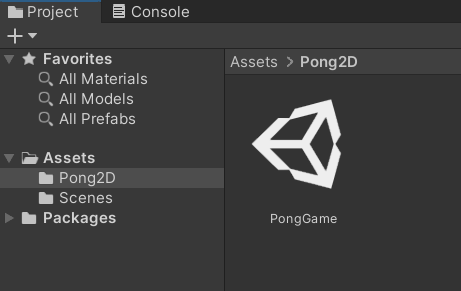

# **Get Started**

To get started, in the **Project** window, create a new folder under the `Assets` folder and name it `Soccer`. All the assets used in this game will be created inside of this folder to make them easy to find.

{: width=512 }

After that, create a new scene in the `Soccer` folder and name it `SoccerGame`.
{: width=512 }