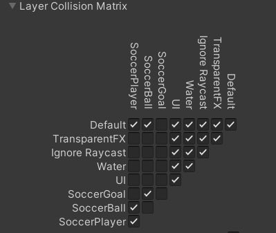

# **Goal**

In this section, you will implement the soccer goal logic.

- Create a new script `SoccerGoal` and add it to the `Goal` GameObject.
- Add a `StaticFrameSyncBehaviour` component to the `Goal` and set its `Own` to `Player1`.

Replace the contents in the `SoccerGoal` script with the following.

=== "C#"
    ``` c#
    using SocketWeaver.FPhysics3D;
    using UnityEngine;
    using SocketWeaver.FrameSync;
    using SocketWeaver.FixedMath;

    namespace SWExample.Soccer
    {
        public class SoccerGoal : MonoBehaviour, IFrameSyncOnStart
        {
            FrameSyncBehaviour _frameSyncBehaviour;

            public void OnStart(FrameSyncBehaviour frameSyncBehaviour)
            {
                _frameSyncBehaviour = frameSyncBehaviour;
            }

            public void OnFTriggerEnter(FCollider3D fCollider)
            {
                FrameSyncUpdateType updateType = _frameSyncBehaviour.game.updateType;
                int frameNumber = _frameSyncBehaviour.game.frameNumber;
                Debug.Log($"{fCollider.name} trigger enter, updateType={updateType} frameNumber={frameNumber}");

                //score
                FrameSyncPlayer player = _frameSyncBehaviour.owner;

                SoccerGameFlow gameFlow = FindObjectOfType<SoccerGameFlow>();

                gameFlow.PlayerScored(player);
            }
        }
    }

    ```

## **Trigger events**

To receive the trigger events of the `Goal` collider:

- Enabled `Events` of the `FRigidbody3D` component of the `Goal` GameObject
- Add an event listener to the `OnTriggerEnter` event, and select `OnFTriggerEnter`. 

{: width=512 }

## **Physics Layer Collision Matrix**

FPhysics supports the Unity physics layer collision matrix. You will create layers and change their collision matrix so the `Goal` collider only collides with the `Ball`.

- Create the following layers and assign the `Car`, the `Ball` and the `Goal` to their layers

Layer Name     | GameObject | Description
--------| --------- | ----------------
SoccerBall    | Ball   | Collides with the cars, the goals, and the Arena   
SocerCars | Cars | Collides with other cars, the ball, and the Arena
SoccerGoal   | Goals     | Collides with the ball only  

- Select `Edit->Project Settings->Physics`.
- Update the `Layer Collision Matrix` to the following:
{: width=512 }

