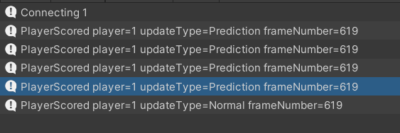

# **Goal Explosion**

In this secion, you are going to add a goal explosion visual effect when player scores.

## **Explosion Force**

If you play the game in the `Online Rollback` mode, when the player scores you will see a few player scored messages. These logs are generated because the player scored in the prediction updates. The game is still deterministic because the scores always get restored to the value before a normal update. We can improve this by only allowing the players to score in a normal update. 

{: width=1080 }

Update/Add the highlighted lines to the `SoccerGoal` script.

=== "C#"
    ``` c# hl_lines="12-19 24 33-51"
    using SocketWeaver.FPhysics3D;
    using UnityEngine;
    using SocketWeaver.FrameSync;
    using SocketWeaver.FixedMath;

    namespace SWExample.Soccer
    {
        public class SoccerGoal : MonoBehaviour, IFrameSyncOnStart
        {
            FrameSyncBehaviour _frameSyncBehaviour;

            FTransform _fTransform;

            [Header("Explosion")]
            public FFloat range = FFloat.FromDivision(30, 1);
            public FCollider3D[] colliders = new FCollider3D[2];
            public LayerMask playerMask;
            public FVector3 forceDirection;
            public FFloat strenge;

            public void OnStart(FrameSyncBehaviour frameSyncBehaviour)
            {
                _frameSyncBehaviour = frameSyncBehaviour;
                _fTransform = GetComponent<FTransform>();
            }

            public void OnFTriggerEnter(FCollider3D fCollider)
            {
                FrameSyncUpdateType updateType = _frameSyncBehaviour.game.updateType;
                int frameNumber = _frameSyncBehaviour.game.frameNumber;
                Debug.Log($"{fCollider.name} trigger enter, updateType={updateType} frameNumber={frameNumber}");

                if(updateType == FrameSyncUpdateType.Normal)
                {
                    //score
                    FrameSyncPlayer player = _frameSyncBehaviour.owner;

                    SoccerGameFlow gameFlow = FindObjectOfType<SoccerGameFlow>();

                    gameFlow.PlayerScored(player);

                    //find nearby players
                    int collidersCount = FPhysics3D.OverlapSphere(_fTransform.position, range, playerMask, colliders);

                    //apply force
                    for (int i = 0; i < collidersCount; i++)
                    {
                        FCollider3D collider = colliders[i];
                        
                        collider.attachedBody.AddForce(forceDirection.normalized * strenge, ForceMode.VelocityChange);
                    }
                }
            }
        }
    }

    ```
- Select the `SoccerGoal` component.
- Set `Player Mask` to `SoccerPlayer`.
- Set `Force Directiont` to (1, 0.3, 0) for player1's goal.
- Set `Force Directiont` to (-1, 0.3, 0) for player2's goal.
- Set `Strengh` to 50.
- Select the `Arcade Car` component of the Cars and disable `Speed Limit`.

## **Explosion Particle Effect**

- Update/Add the highlighted lines to the `SoccerGameFlow` script. 
- You will instantiate a particle effect and disable the ball when the players score. 
- When resetting the game, you will re-enable the ball. 
- Drag the SoccerExplosion prefab to the `SoccerGameFlow` inspector.

!!! note ""
    
    The active state of the ball is a game state that affects the simulation result. The `FrameSyncEngine` snapshots the active state of `FrameSyncBehaviour` GameObject automatically.


=== "C#"
    ``` c# hl_lines="35-36 92-93 98"
    using SocketWeaver.FrameSync;
    using SocketWeaver.FixedMath;
    using UnityEngine;
    using UnityEngine.UI;
    using SocketWeaver.FPhysics3D;
    using SocketWeaver.Core;

    namespace SWExample.Soccer
    {
        public class SoccerGameFlow : MonoBehaviour, IFrameSyncTimerEventHandler, IFrameSyncOnStart, IFrameSyncComputerUpdate, IFrameSyncDataContainer
        {
            [Header("UI")]
            public Text timeText;
            public Text player1Text;
            public Text player2Text;

            [Header("Rigidbodies")]
            public FRigidbody3D ball;
            public FRigidbody3D player1;
            public FRigidbody3D player2;

            [Header("Start Positions")]
            public FTransform ballStartPosition;
            public FTransform player1StartPosition;
            public FTransform player2StartPosition;

            [Header("Scores")]
            public int player1Score;
            public int player2Score;

            [Header("Timer")]
            public FFloat resetGameTime = FFloat.FromDivision(5, 1);
            public int resetTimer;

            [Header("VFX")]
            public GameObject scoreEffect;

            FrameSyncBehaviour _frameSyncBehaviour;

            public void OnStart(FrameSyncBehaviour frameSyncBehaviour)
            {
                _frameSyncBehaviour = frameSyncBehaviour;

                resetTimer = FrameSyncTimer.CreateTimer(resetGameTime, false);
            }

            public void OnComputerUpdate(FrameSyncGame game)
            {
                float elapsed = (float)game.Elapsed();

                int seconds = (int)elapsed;

                int minutes = seconds / 60;
                seconds = seconds % 60;

                timeText.text = $"{minutes.ToString("00")}:{seconds.ToString("00")}";

                player1Text.text = $"{player1Score}";
                player2Text.text = $"{player2Score}";
            }

            public void OnTimerEvent(int timerId, FFloat elapsed)
            {
                FrameSyncUpdateType updateType = _frameSyncBehaviour.game.updateType;
                int frameNumber = _frameSyncBehaviour.game.frameNumber;

                if (timerId == resetTimer)
                {
                    Debug.Log($"ResetTimer updateType={updateType} frameNumber={frameNumber}");
                    ResetGame();
                }
            }

            public void PlayerScored(FrameSyncPlayer player)
            {
                Debug.Log($"PlayerScored player={player.playerId}");

                //update player scores
        
                if (player.playerId == 1)
                {
                    player1Score++;
                }

                if (player.playerId == 2)
                {
                    player2Score++;
                }

                FrameSyncTimer.RestartTimer(resetTimer);

                ball.gameObject.SetActive(false);
                Instantiate(scoreEffect, ball.transform.position, ball.transform.rotation);
            }

            void ResetGame()
            {
                ball.gameObject.SetActive(true);

                ResetRigidbody(ball, ballStartPosition);
                ResetRigidbody(player1, player1StartPosition);
                ResetRigidbody(player2, player2StartPosition);
            }

            void ResetRigidbody(FRigidbody3D fRigidbody3D, FTransform startPosition)
            {
                fRigidbody3D.position = startPosition.position;
                fRigidbody3D.rotation = startPosition.rotation;
                fRigidbody3D.fTransform.Teleport(startPosition.position);

                fRigidbody3D.velocity = FVector3.zero;
                fRigidbody3D.angularVelocity = FVector3.zero;
            }
        
            public void OnImport(SWBytes buffer)
            {
                player1Score = buffer.PopInt();
                player2Score = buffer.PopInt();

                resetTimer = buffer.PopInt();
            }

            public void OnExport(SWBytes buffer)
            {
                buffer.Push(player1Score);
                buffer.Push(player2Score);

                buffer.Push(resetTimer);
            }
        }
    }

    ```

## **Reset Transition**

- Update/Add the highlighted lines to the `SoccerGameFlow` script. 
- Create 2 more FrameSyncTimers for the fade-in and fade-out effects.
- Check the UpdateType of the FrameSyncGame. The visual effects should only run in a normal update.

=== "C#"
    ``` c# hl_lines="16 32-37 49-50 73-102 133-140 167-168 177-178"
    using SocketWeaver.FrameSync;
    using SocketWeaver.FixedMath;
    using UnityEngine;
    using UnityEngine.UI;
    using SocketWeaver.FPhysics3D;
    using SocketWeaver.Core;

    namespace SWExample.Soccer
    {
        public class SoccerGameFlow : MonoBehaviour, IFrameSyncTimerEventHandler, IFrameSyncOnStart, IFrameSyncComputerUpdate, IFrameSyncDataContainer
        {
            [Header("UI")]
            public Text timeText;
            public Text player1Text;
            public Text player2Text;
            public Image fade;

            [Header("Rigidbodies")]
            public FRigidbody3D ball;
            public FRigidbody3D player1;
            public FRigidbody3D player2;

            [Header("Start Positions")]
            public FTransform ballStartPosition;
            public FTransform player1StartPosition;
            public FTransform player2StartPosition;

            [Header("Scores")]
            public int player1Score;
            public int player2Score;

            [Header("Timer")]
            public FFloat resetGameTime = FFloat.FromDivision(5, 1);
            public FFloat fadeTime = FFloat.FromDivision(2, 1);
            public int resetTimer;
            public int fadeInTimer;
            public int fadeOutTimer;

            [Header("VFX")]
            public GameObject scoreEffect;

            FrameSyncBehaviour _frameSyncBehaviour;

            public void OnStart(FrameSyncBehaviour frameSyncBehaviour)
            {
                _frameSyncBehaviour = frameSyncBehaviour;

                resetTimer = FrameSyncTimer.CreateTimer(resetGameTime, false);
                fadeInTimer = FrameSyncTimer.CreateTimer(fadeTime, false);
                fadeOutTimer = FrameSyncTimer.CreateTimer(fadeTime, false);
            }

            public void OnComputerUpdate(FrameSyncGame game)
            {
                float elapsed = (float)game.Elapsed();

                int seconds = (int)elapsed;

                int minutes = seconds / 60;
                seconds = seconds % 60;

                timeText.text = $"{minutes.ToString("00")}:{seconds.ToString("00")}";

                player1Text.text = $"{player1Score}";
                player2Text.text = $"{player2Score}";
            }

            public void OnTimerEvent(int timerId, FFloat elapsed)
            {
                FrameSyncUpdateType updateType = _frameSyncBehaviour.game.updateType;
                int frameNumber = _frameSyncBehaviour.game.frameNumber;

                if (timerId == resetTimer)
                {
                    Debug.Log($"ResetTimer updateType={updateType} frameNumber={frameNumber}");

                    if (updateType == FrameSyncUpdateType.Normal)
                    {
                        FrameSyncTimer.RestartTimer(fadeInTimer);
                    }
                }

                if (timerId == fadeInTimer)
                {
                    Debug.Log($"fadeInTimer updateType={updateType} frameNumber={frameNumber}");

                    if (updateType == FrameSyncUpdateType.Normal)
                    {
                        CrossFade(1, 1);
                        FrameSyncTimer.RestartTimer(fadeOutTimer);
                    }
                }

                if (timerId == fadeOutTimer)
                {
                    Debug.Log($"fadeOutTimer updateType={updateType} frameNumber={frameNumber}");
                    if (updateType == FrameSyncUpdateType.Normal)
                    {
                        ResetGame();
                        CrossFade(0, 1);
                    }
                }
            }

            public void PlayerScored(FrameSyncPlayer player)
            {
                Debug.Log($"PlayerScored player={player.playerId}");

                if (FrameSyncTimer.IsInvoking(resetTimer))
                {
                    Debug.Log("Game resetting ignored");
                    return;
                }

                //update player scores
        
                if (player.playerId == 1)
                {
                    player1Score++;
                }

                if (player.playerId == 2)
                {
                    player2Score++;
                }

                FrameSyncTimer.RestartTimer(resetTimer);

                ball.gameObject.SetActive(false);
                Instantiate(scoreEffect, ball.transform.position, ball.transform.rotation);
            }

            void CrossFade(float alpha, float duration)
            {
                Color fixedColor = fade.color;
                fixedColor.a = 1;
                fade.color = fixedColor;
                fade.CrossFadeAlpha(0f, 0f, true);
                fade.CrossFadeAlpha(alpha, duration, false);
            }

            void ResetGame()
            {
                ball.gameObject.SetActive(true);

                ResetRigidbody(ball, ballStartPosition);
                ResetRigidbody(player1, player1StartPosition);
                ResetRigidbody(player2, player2StartPosition);
            }

            void ResetRigidbody(FRigidbody3D fRigidbody3D, FTransform startPosition)
            {
                fRigidbody3D.position = startPosition.position;
                fRigidbody3D.rotation = startPosition.rotation;
                fRigidbody3D.fTransform.Teleport(startPosition.position);

                fRigidbody3D.velocity = FVector3.zero;
                fRigidbody3D.angularVelocity = FVector3.zero;
            }
        
            public void OnImport(SWBytes buffer)
            {
                player1Score = buffer.PopInt();
                player2Score = buffer.PopInt();

                resetTimer = buffer.PopInt();
                fadeInTimer = buffer.PopInt();
                fadeOutTimer = buffer.PopInt();
            }

            public void OnExport(SWBytes buffer)
            {
                buffer.Push(player1Score);
                buffer.Push(player2Score);

                buffer.Push(resetTimer);
                buffer.Push(fadeInTimer);
                buffer.Push(fadeOutTimer);
            }
        }
    }

    ```

- Create a UI Panel under the Canvas and name it `Fade`.
- Set its source image to None.
- Set its color to Black and alpha to 0.
- Drag the `Fade` panel to the `SoccerGameFlow` component in the inspector.