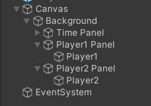
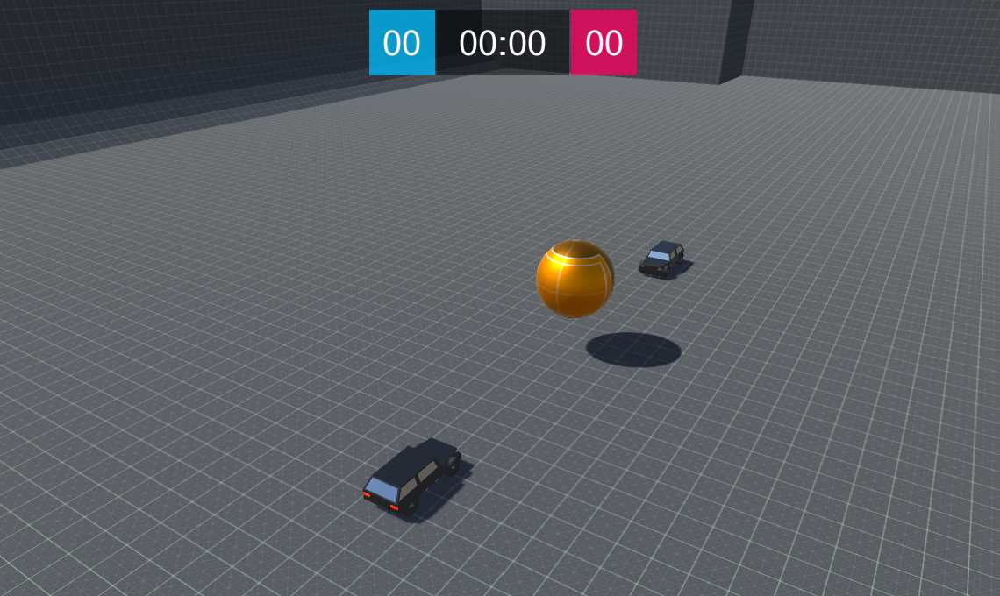

# **HUD**

In this section, you will add a HUD to show the scores of the players.

## **Background**
- Add a UI Panel and name it `Background`.
- Set its RectTransform Anchor Preset to Stretch Top.
- Set RectTransform left: `0`, Right: `0`, Height: `200`, Ros Y: `-100`, Pos Z: `0`
- Remove its source image, and set color alpha to 0.

## **Time**
- Add a child UI Panel under `Background`and name it `Time Panel`.
- Set its RectTransform Anchor Preset to `Center Middle`.
- Set RectTransform Width: `150`, Height: `75`, Pos X: `0`, Pos Y: `50`, Pos Z: `0`
- Remove its source image, and set color to black and alpha to 0.5.
- Add a Text under `Time Panel` and name it `Time`.
- Set its RectTransform Anchor Preset to `Center Middle`.
- Set RectTransform Width: `150`, Height: `75`, Pos X: `0`, Pos Y: `0`, Pos Z: `0`
- Set Font size to 40.
- Set Text Alignment to horizontal center, and vertical center.
- Set Text color to white.

## **Player1 Score**
- Add a child UI Panel under `Background`and name it `Player1 Panel`.
- Set its RectTransform Anchor Preset to `Center Middle`.
- Set RectTransform Width: `75`, Height: `75`, Pos X: `-115`, Pos Y: `50`, Pos Z: `0`
- Remove its source image, and set color to blue and alpha to 0.75.
- Add a Text under `Player1 Panel` and name it `Player1`.
- Set its RectTransform Anchor Preset to `Center Middle`.
- Set RectTransform Width: `75`, Height: `75`, Pos X: `0`, Pos Y: `0`, Pos Z: `0`
- Set Font size to 40.
- Set Text Alignment to horizontal center, and vertical center.
- Set Text color to white.

## **Player2 Score**
- Add a child UI Panel under `Background`and name it `Player2 Panel`.
- Set its RectTransform Anchor Preset to `Center Middle`.
- Set RectTransform Width: `75`, Height: `75`, Pos X: `115`, Pos Y: `50`, Pos Z: `0`
- Remove its source image, and set color to red and alpha to 0.74.
- Add a Text under `Player2 Panel` and name it `Player2`.
- Set its RectTransform Anchor Preset to `Center Middle`.
- Set RectTransform Width: `75`, Height: `75`, Pos X: `0`, Pos Y: `0`, Pos Z: `0`
- Set Font size to 40.
- Set Text Alignment to horizontal center, and vertical center.
- Set Text color to white.

The Hierarchy should look like

{: width=360 }

The Scene should look like

{: width=1080 }