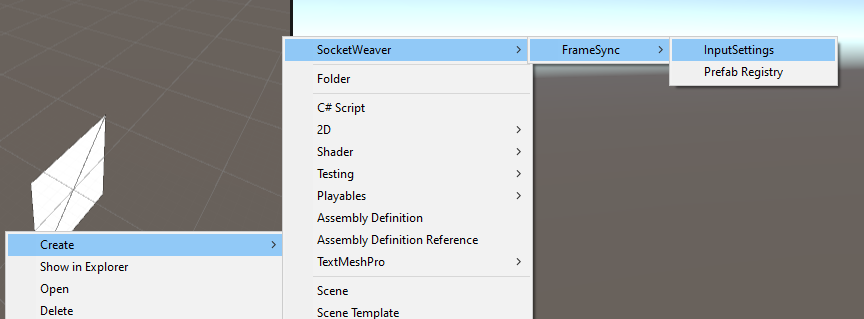
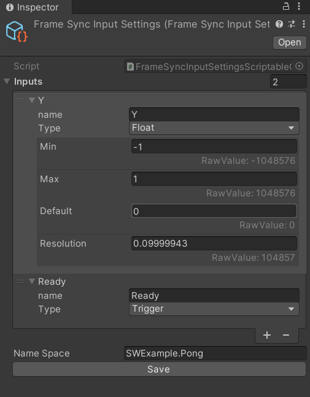

# **Declare Inputs for Your Game**

In this section, you will create an InputSettings scriptableObject for your game.

## **Creating an InputSettings ScriptableObject**

- Right click in the project browser, and select `Create->SocketWeaver->FrameSync->InputSettings`. 
- Name the new asset `FrameSyncInputSettings`.

{: width=1080 }

## **Adding Inputs**

In this game, the player uses the `WASD` to drive the car.

- Select the `FrameSyncInputSettings` and configure it as shown below.
{: width=512 }

- Make sure that `Name Space` is set to `SWExample.Soccer` which is the c# namespace of this game.
- Click the `Save` button.
