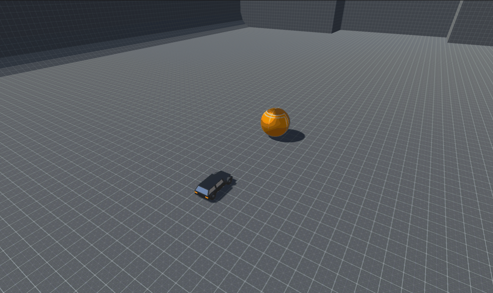

# **Playing Online**

Belive it or not, your game is almost ready to be played online. Let's first add a car and another goal for player2.

- Drag the `Car` to the **Project** window to make it a prefab.
- Drag the `Car` prefab to the scene for player2.
- Do the same for the `Goal`.
- Move the player2 car to (65, 0.6, 50).
- Rotate the player2 car to (0, 90, 0).
- Move the player2 goal to (158.4, 6, 50).

## **FrameSync Demo Lobby Scene**

You will use the demo lobby scene that comes with the library to handle the matchmaking of the game.

- Open the Lobby scene.
- Select the Lobby GameObject and set `Scene Name` to `SoccerGame`

???+ info

    Make sure to add the `PongGame` scene to the build settings.

???+ info

    Make sure to change the `Engine Mode` of the `SoccerFrameSyncEngineController` to `Online`. 

## **Launch Another Instance of The Unity Editor**

Install ParrelSync, and Select `ParrelSync->Clones Manager->Add new clone`, and select `Open in New Editor` after the clone is created.

## **Test**
Hit **Play**, you should be control the car using the `WASD` keys. 

When the ball hits the invisible goal, you should see "PlayerScored player={playerID}" in the **Console**.
{: width=1080 }