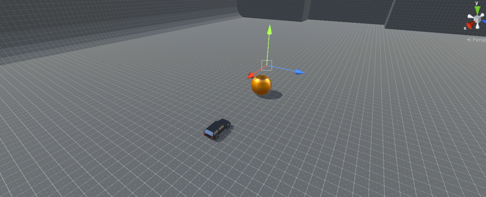

# **Set Up The Scene**

## **FPhysics3DManager**
For your first step, you will create a `FPhysics3DManager`. Right-Click in the `Hierarchy` window and select `SocketWeaver->FPhysics->3D->Physics Controller`. Make sure to disable `Auto Initialize` and `Auto Update`.

## **Rigidbodies**

Next, you will create the following Rigidbodies.

Name    | Body Type | Description
--------| --------- | ----------------
Ball    | Dynamic   | Controlled by physics
Cars | Dynamic | Controlled by players
Arena   | Static     | Does not move
Goals   | Static     | Do not move

## **Arena**

- Download the assets from our github repository.
- Drag the `Arena` 3D model to the `SoccerGame` scene.
- Move the `Arena` to  (0, 0, 0). 
- Add a `FMeshCollider3D` component to the `Arena`. A `FTransform` component should be automatically added.
- Add a `FRigidbody3D` component to the `Arena` and set its `Body Type` to `Static`.

## **Ball**

- Select `SocketWeaver->FPhysics->3D->Sphere`. 
- Select the sphere and name it `Ball`.
- Move the `Ball` to  (75, 1.5, 50). 
- Set its scale to (3, 3, 3).
- Select the `FSphereCollider` component.
- Set `Bounciness` to 0.5.
- Enable `Override Mass` and set `Custom Mass` to 0.1.

## **Cars**

- In the FPhysics3D samples folder, select the `Car` prefab at `Samples->3D->Scripts->Vehicle->SimpleRaycast`.
- Drag it to the `SoccerGame` scene.
- Select the `Car` in the **Hierarchy**, right click and select `Prefab->Unpack Completely`.
- Move the `Car` to (85, 0.6, 50).
- Rotate the `Car` to (0, -90, 0).

## **Goals**

- Select `SocketWeaver->FPhysics->3D->Cube`.
- Select the cue and name it `Goal`.
- Move the `Goal` to (-8.4, 6, 50).
- Set its scale to (10, 12, 34).
- Select the `FRigidbody3D` of the `Goal` and set `BodyType` to `Static`.
- Select the `FBoxCollider3D` of the `Goal` and enable `Is Trigger`.

## **Final Touch**
In the asset folder, we included the **prototype textures** pack from **Kenney**. You can select the textures you like and assign them to the materials of the `Arena` and the `Ball`.

The scene should look like.

{: width=1080 }

## **Test**
Hit **Play**, you should be control the car using the `WASD` keys. 
{: width=1080 }