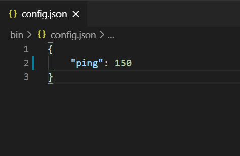

# Rollback

You can adjust the `ping` value in the config.json file to simulate a bad internet connection.

Set the `ping` to 150, it will inject a delay of 150ms to the packets sent between the debug server and the game clients. The RTT for the connections will be 300ms now.

{: width=720 }

Play the game again, the input delay should be very noticeable. You'll add **Rollback** to your game to make it more responsive.

# IResotrable

First, you will create a new class that implements IRestorable interface. 

A Rollback enabled game needs to rollback the game states to a confirmed frame from the server. 
The FrameSyncEngine will take care of the game states stored in the `IFrameSyncData` components.
You need to provide the FrameSyncEngine with a IRestorable object to restore any states that are not stored in a `IFrameSyncData` component.

=== "C#"
    ``` c#
    public class MyRestorable : IRestorable
    {
        PSnapshot2D snapshot2D;

        public int frameNumber { get; }

        public MyRestorable(int frameNumber)
        {
            // 1
            snapshot2D = Parallel2D.Snapshot();
            this.frameNumber = frameNumber;
        }

        public void Clear()
        {
            // 2
            Parallel2D.DestroySnapshot(snapshot2D);
        }

        public void Restore()
        {
            // 3
            Parallel2D.Restore(snapshot2D);
        }
    }
    ```

In `// 1`, you create a snapshot of the **Parallel** physics world. The created `MyRestorable` will be passed to the FrameSyncEngine.

In `// 2`, The FrameSyncEngine will call the `Clear()` method when it does not need to rollback to the frame for a `IRestorable`. You will destory the snapshot to free the memory in the Parallel physics world.

In `// 3`, The FrameSyncEngine will call the `Restore()` method when it wants to rollback to the frame for a `IRestorable`. You will use the snapshot to restore the physics state of the **Parallel** physics world. 

Next, add a public field `rollback` to the `MyFrameSyncAgent` script to enable/disable **Rollback** in the inspector.

=== "C#"
    ``` c#
    public bool rollback = false;
    ```

## OnEngineWillExportEvent

Make the following change to the `OnFrameSyncEngineCreated` method.

=== "C#"
    ``` c#
    public override void OnFrameSyncEngineCreated(FrameSyncEngine engine)
    {
        // 1
        FrameSyncInputSetting[] inputSettings = new FrameSyncInputSetting[2];

        // 2
        inputSettings[0] = FrameSyncInputSetting.CompressedFloatInput(
                                                               "y",
                                                               Fix64.FromDivision(-1, 1),
                                                               Fix64.FromDivision(1, 1),
                                                               Fix64.FromDivision(1, 10),
                                                               Fix64.zero);

        // 3
        inputSettings[1] = FrameSyncInputSetting.TriggerInput("ready");

        // 4
        FrameSyncInputConfig inputConfig = new FrameSyncInputConfig(inputSettings);
        engine.SetFrameSyncInputConfig(inputConfig);

        // 5
        parallelPhysics = FindObjectOfType<ParallelPhysicsController2D>();
        parallelPhysics.autoUpdate = false;

        // 6
        engine.OnEngineWillSimulateEvent += FrameSyncEngineWillSimulate;

        // 7
        if(!offline)
        {
            engine.SetNetworkIO(FrameSyncClient.Instance.frameSyncIO);

            // 8
            if(rollback)
            {
                engine.OnEngineWillExportEvent += FrameSyncEngineWillExport;
            }
        }
    }
    ```

In `// 8`, we add our handler to the `OnEngineWillExportEvent` if `rollback` is enabled;

=== "C#"
    ``` c#
    IRestorable FrameSyncEngineWillExport(int frameNumber)
    {
        MyRestorable restorable = new MyRestorable(frameNumber);
        return restorable;
    }
    ```

You create an `IRestorable` in the event handler and returned it to the FrameSyncEngine.

## Enable Rollback

Make the following change to the `OnFrameSyncGameCreated` method

=== "C#"
    ``` c#
    public override void OnFrameSyncGameCreated(FrameSyncGame game, FrameSyncReplay replay)
    {
        if (offline)
        {
            // 1
            game.type = FrameSyncGameType.Offline;

            // 2
            player1 = game.CreateOfflineGamePlayer();
            player2 = game.CreateOfflineGamePlayer();

            // 3
            MyGameSettings gameSettings = new MyGameSettings();
            gameSettings.player1ID = player1.PlayerID;
            gameSettings.player2ID = player2.PlayerID;

            // 4
            game.userData = gameSettings;
        }
        else
        {
            // 5
            game.type = FrameSyncGameType.Online;

            // 6
            game.SetPlayerDataProvider(FrameSyncClient.Instance.playerDataProvider);
            game.CreateOnlinePlayers();

            // 7
            game.CreateGameUserData<MyGameSettings>();

            //todo: game settings will be created in the matchmaking stage
            MyGameSettings gameSettings = new MyGameSettings();
            gameSettings.player1ID = 1;
            gameSettings.player2ID = 2;
            game.userData = gameSettings;

            // 8
            game.clientSidePrediction = clientSidePrediction;
        }
    }
    ```

In `// 8`, you enabled `clientSidePrediction` on your game.

Play the game, the input delay should be reduced a lot now.

## Prediction Modifier

You can use the `Prediction Modifier` to control the extrapolation for the other players. By default, the FrameSyncEngine just reuses the last received inputs to simulate other players for the prediction frames. 

Make the following change to the `OnFrameSyncEngineCreated` method.

=== "C#"
    ``` c#
    // 2
    inputSettings[0] = FrameSyncInputSetting.CompressedFloatInput(
                                                            "y",
                                                            Fix64.FromDivision(-1, 1),
                                                            Fix64.FromDivision(1, 1),
                                                            Fix64.FromDivision(1, 10),
                                                            Fix64.zero,
                                                            PredictionModifier);
    ```

In `// 2`, you set the `PredictionModifier` method as the `Prediction Modifier` of the `y` input.

=== "C#"
    ``` c#
    Fix64 PredictionModifier(Fix64 value)
    {
        return value * Fix64.half;
    }
    ```

The `PredictionModifier` method is very simply, the `y` input is decayed by 50%. 

The `PredictionModifier` method is called for every prediction frame, and the output of frame `n` will be used as the input for frame `n+1`. So if the initial value of `y` is 1, the predicted values of `y` in the predicted frames will be `0.5`, `0.25`, `0.125`...