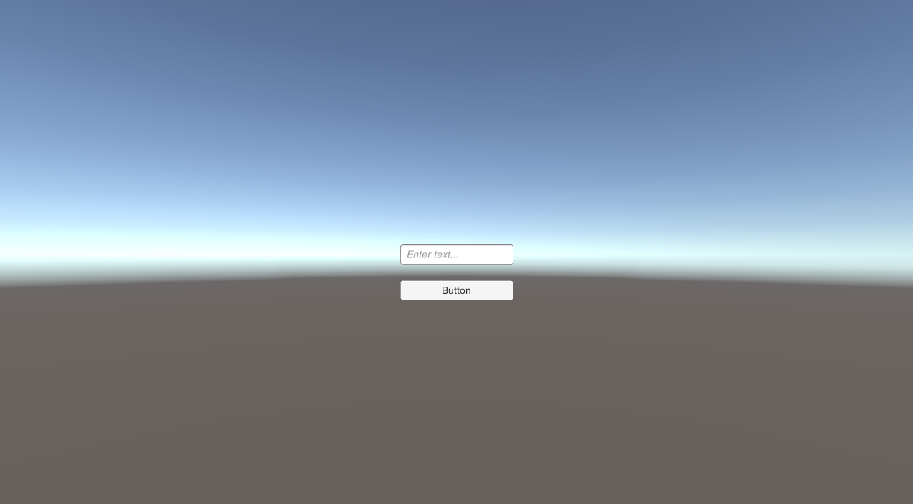
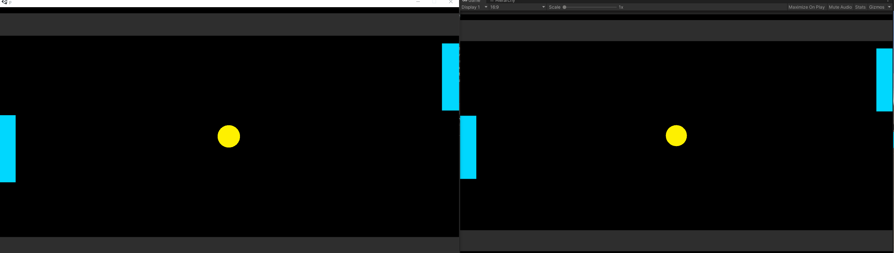

# Building the Game

## 64-bit architecture
FrameSync only supports 64-bit systems. You'll go to `File`->`Build Settings` and set `Architecture` to 64-bit. 

{: width=720 }

## Windowed mode
Next, go to `Player Settings` and set `FullScreen Mode` to `Windowed`.
Also, set `Default Screen Width` to `1280` and `Default Screen Hight` to `720`.

## Entering the debug PlayerUID
Click on the Build button to build the game.
You should see something like this once the game is launched.

{: width=720 }

The debug server has playerUID `1`-`8` available to use, you can connect up to 8 players to it for testing. For this game, you will use playerUID of `1` and `2` since there are only 2 players.

You can run one instance of the game using the built game client, and another one in the Unity Editor. The paddles and the ball should be synchronized. 

{: width=720 }