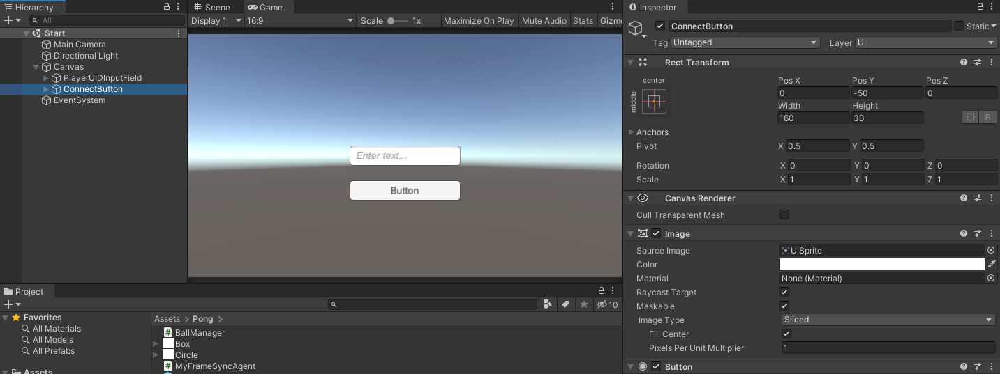

# Connecting to the Debug Server

## Start scene
You'll create a new scene for creating the connection with the debug game server. 

Create a new scene and change its name to `Start` as it will be the first scene that players see when game starts.

Open the Build Settings and add the `Start` scene to the build.

{: width=720 }

## Adding UI elements

You just need to add two UI elements for this game.

Name                    | Type       | Description
----------------------- | ---------- |----------------
PlayerUIDInputField     | InputField | To enter the playerUID
ConnectButton           | Button     | To Start the connection

{: width=720 }

## MyGameServerConnection

Next, create a new empty GameObject and name it `MyGameServerConnection`.
Create a new script `MyGameServerConnection.cs` and attach it to the `MyGameServerConnection` GameObject.

Replace the code in the script with the following.

=== "C#"
    ``` c#
    using SWNetwork.FrameSync;
    using System.Collections;
    using System.Collections.Generic;
    using UnityEngine;
    using UnityEngine.SceneManagement;
    using UnityEngine.UI;

    public class MyGameServerConnection : MonoBehaviour
    {
        /// <summary>
        /// InputField for entering the playerUID
        /// </summary>
        public InputField playerUIDField;
        
        public void Connect()
        {
            string playerUID = playerUIDField.text;
            Debug.Log($"Connecting.. {playerUID}");

            if (playerUID != null && playerUID.Length > 0)
            {
                // 1
                FrameSyncClient.InitDebugMode(playerUID, 2);

                // 2
                FrameSyncClient.ConnectDebugServer("127.0.0.1", ready =>
                {
                    Debug.Log($"OnClientReady {ready}");
                    if (ready)
                    {
                        // 3
                        SceneManager.LoadScene("Pong");
                    }
                });
            }
            else
            {
                Debug.LogError("Please Enter a playerID");
            }
        }
    }

    ```

In `// 1`, To test your game with the debug server. You used `InitDebugMode` method to initialize the `FrameSyncClient`. There are two players in the game, so you set the `playerCount` of the `FrameSyncClient` to 2.

In `// 2`, you call the `ConnectToDebugServer` method to start the connection with the debug server on the local machine.

In `// 3`, you load the `pong` scene if the connection is established.

Next, you'll connect the UI elements and the script.

- Drag the `PlayerUIDInputField` to the `MyGameServerConnection` component.

{: width=720 }

- Select the `Connect()` method of the `MyGameServerConnection` component to handle the `OnClick` event of the connect button.

{: width=720 }