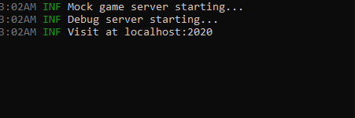

# Debug Server

FrameSync comes with a debug server that helps you test and debug your game on your local machines.

## Install

You can download the debug server from our github page.

https://github.com/shuningzhou/FrameSyncDebugServer

## Launch the server

**Double Click** the `debugserver` application in the `bin` folder to launch the debug server. You should see something like the following in the terminal.

{: width=720 }

Minimize the terminal to keep the server running.

Now, you can open your browser and visit the debug server at `localhost:2020`. You should see something like the following in the browser.

{: width=720 }