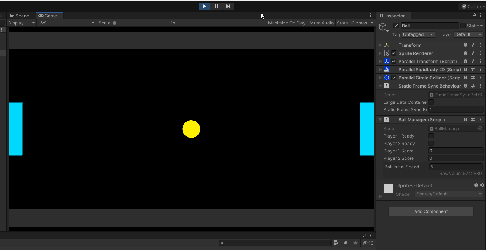

# Playing Offline

Before playing the game, you need to set the gravity of the game to zero. 

Select the `ParallelPhysicsController2D`component and setting its `Gravity` to `(0,0)`.

{: width=720 }

After that, you can remove the friction of the walls by selecting the `ParallelBoxCollider` components of the them and setting their `Friction` value to `0`. Also, you can set `Bounciness` value of the colliders in the scene to `1` to make them bouncy.

{: width=720 }

Now, you are ready to play the game in the offline mode. Just hit play. You should be able to move the paddles with the `w`, `s` keys or with the arrow keys.

To start the match, you can press `g` to make player1 ready, and press `h` to make player2 ready.

{: width=720 }

