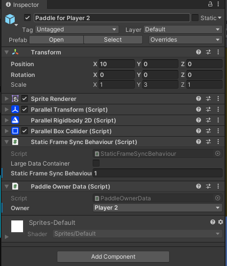

# Paddle Owner

Before implementing the paddle movement logic, you need to assign the paddles to the players.

Do this by adding a new script called `PaddleOwnerData` to the `Paddle` GameObject. 

Replace the content of the script with the following. Note that the `PaddleOwnerData` implements the `IFrameSyncData` interface.

=== "C#"
    ``` c#
    using SWNetwork.Core;
    using SWNetwork.FrameSync;
    using System.Collections.Generic;
    using UnityEngine;

    public class PaddleOwnerData : MonoBehaviour, IFrameSyncData
    {
        public enum PaddleOwner
        {
            Player1,
            Player2
        }

        // set in the inspector
        public PaddleOwner owner;

        // reference to the FrameSyncPlayer
        // set when initializing the FrameSyncData
        SWFrameSyncPlayer _player;

        public void FrameSyncDataInitialize(SWFrameSyncGame game)
        {

        }

        public void Export(SWBytes buffer)
        {
            
        }

        public void Import(SWBytes buffer)
        {
            
        }

        public void ExportDebugInfo(Dictionary<string, string> debugDictionary)
        {
            
        }
    }
    ```
## FrameSyncDataInitialize

The `FrameSyncDataInitialize` method is called before the first `FrameSyncUpdate()` call to the GameObject. You'll implement the logic to assign paddles to their owners in it.


=== "C#"
    ``` c#
    public void FrameSyncDataInitialize(SWFrameSyncGame game)
    {
        // 1
        MyGameSettings gameSettings = game.userData as MyGameSettings;

        // 2
        if (owner == PaddleOwner.Player1)
        {
            player = game.GetPlayer(gameSettings.player1ID);
        }
        else
        {
            player = game.GetPlayer(gameSettings.player2ID);
        }
    }
    ```
In `// 1`, you get the custom data of the game.

In `// 2`, you use the playerIDs of custom data and the `owner` field of the script to get the `FrameSyncPlayers`. You'll use the `FrameSyncPlayers` to read their inputs. 

???+ info
    The `owner` field is set in the inspector and should never change. We can leave the `Export`, `Import`, and the `ExportDebugInfo` method empty.

In the `Inspector` window, click the `Overrides` button to add the `PaddleOwnerData` script to the other paddle in the scene. Assign the other paddle to player2 by setting its owner to `Player 2`. Now you should have 1 paddle for `Player 1` and 1 paddle for `Player 2`.

{: width=375 }
{: width=375 }