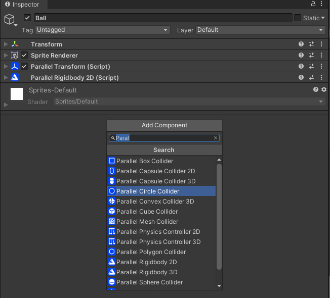
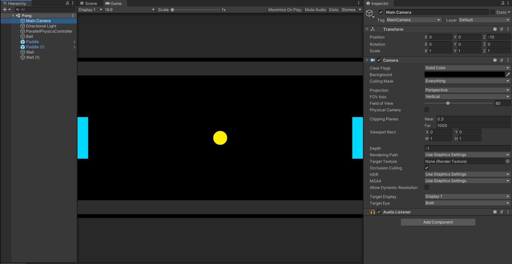

# Physics 2D

FrameSync comes with a built-in physics engine to help you simulate physics in your game.

In this tutorial, you are going to use the build-in 2D physics to simulate the ball's movment. 

For your first step, you will create a 2D Physics Controller.
**Right-Click** in the `Hierarchy` window and select `Parallel`->`2D`->`Physics Controller`.

{: width=720 }

## Rigidbodies

Next, you will create the following Rigidbodies.

Name    | Body Type | Description
--------| --------- | ----------------
Ball    | Dynamic   | Controlled by physics
Paddles | Kinematic | Controlled by players
Walls   | Staic     | Do not move

## Creating the ball

- Create a 2D Sprite GameObject by selecting `2D Object`->`Sprite` and name it `Ball`.

{: width=720 }

- Create a circle sprite by selecting `Create`->`Sprites`->`Circle` in the `Project` windows. 

- Assign the circle sprite to the `Ball` 2D GameObject.

- Reset the `Transform` component of the `Ball` GameObject to make sure it is positioned at `(0 ,0, 0)`.

- Add a ParallelRigidbody2D componenet to the `Ball` GameObject.

{: width=720 }

- Add a ParallelCircleCollider componenet to the `Ball` GameObject.

{: width=720 }

## Creating the paddles

- Create a 2D Sprite GameObject by selecting `2D Object`->`Sprite` and name it `Paddle`.

- Create a box sprite by selecting `Create`->`Sprites`->`Square` in the `Project` windows. 

- Assign the box sprite to the `Paddle` GameObject.

- Move the `Paddle` to `(-10, 0, 0)`.

- Set the `Scale` of `Paddle` to `(1, 3, 1)`.

- Add a ParallelRigidbody2D componenet to the `Paddle` GameObject.

- Add a ParallelBoxCollider componenet to the `Paddle` GameObject.

- Set `Body Type` of the ParallelRigidbody2D component to `Kinematic`.

{: width=720 }

- Drag the `Paddle` to the `Project` window to make it a prefab and make another `Paddle` at `(10, 0, 0)`.

## Creating the walls

- Create a 2D Sprite GameObject by selecting `2D Object`->`Sprite` and name it `Wall`.

- Assign the box sprite to the `Wall` GameObject.

- Move the `Wall` to `(0, 5, 0)`.

- Set the `Scale` of `Wall` to `(21, 1, 1)`.

- Add a ParallelRigidbody2D componenet to the `Wall` GameObject.

- Add a ParallelBoxCollider componenet to the `Wall` GameObject.

- Set `Body Type` of the ParallelRigidbody2D component to `Static`.

- Duplicate the `Wall` and place the duplicated `Wall (1)` at `(0, -5, 0)`.

## Setting up the camera

- Set `clear Flags` of the Main Camera to `Solid Color`.
- Set `Background` of the Main Camera to black.
- Set `Aspect ratio` of the `Game` window to `16:9`.
{: width=720 }

## Final touch

You can change the color of the sprite to your liking. The scene should look like.

{: width=760 }

