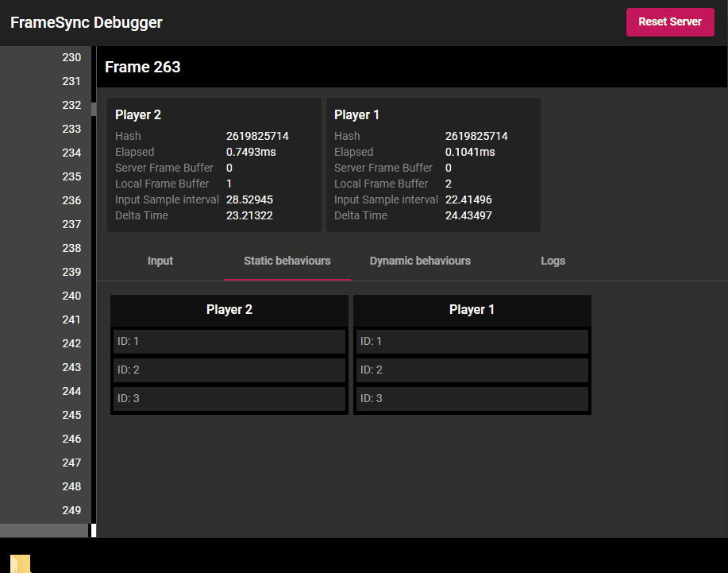

# Frame Information

The frame information is exported from the game clients and displayed on the debug server.

{: width=720 }

You can see in the screenshot that both player1's game and player2's game generated the same simulation result hash for frame 263. That means the simulation results are identical.

In the `Input` tab, you can view the Input values used in the game clients for frame 263.

{: width=720 }

In the `Static Behaviours` tab, you can view the data of the static behaviours. There are no data displayed here at the moment because we left the `ExportDebugInfo` methods empty.

Add the following to the `ExportDebugInfo` methods.

## Export frame info for PaddlePositionData

=== "C#"
    ``` c#
    public void ExportDebugInfo(Dictionary<string, string> debugDictionary)
    {
        debugDictionary["x"] = parallelTransform.position.x.ToString();
        debugDictionary["y"] = parallelTransform.position.y.ToString();
    }
    ```

## Export frame info for PaddleOwnerData

=== "C#"
    ``` c#
    public void ExportDebugInfo(Dictionary<string, string> debugDictionary)
    {
        debugDictionary["owner"] = owner.ToString();
    }
    ```

## Export frame info for BallManager

=== "C#"
    ``` c#
    public void ExportDebugInfo(Dictionary<string, string> debugDictionary)
    {
        debugDictionary["player1Ready"] = player1Ready.ToString();
        debugDictionary["player2Ready"] = player2Ready.ToString();
        debugDictionary["player1Score"] = player1Score.ToString();
        debugDictionary["player2Score"] = player2Score.ToString();
        debugDictionary["ballPosition"] = parallelTransform.position.ToString();
        debugDictionary["Velocity"] = parallelRigidbody2D.LinearVelocity.ToString();
        debugDictionary["AngularVelocity"] = parallelRigidbody2D.AngularVelocity.ToString();
    }
    ```

## Reset the debug server

You need to click the `Reset Server` button at the top right corner of the debug server page to reset the debug server. It will clear the debug frame information for the last game and prepare the server for you to connect again.

{: width=720 }

Build and play the game. You should see something like this in the `Static Behaviours` tab.

{: width=720 }